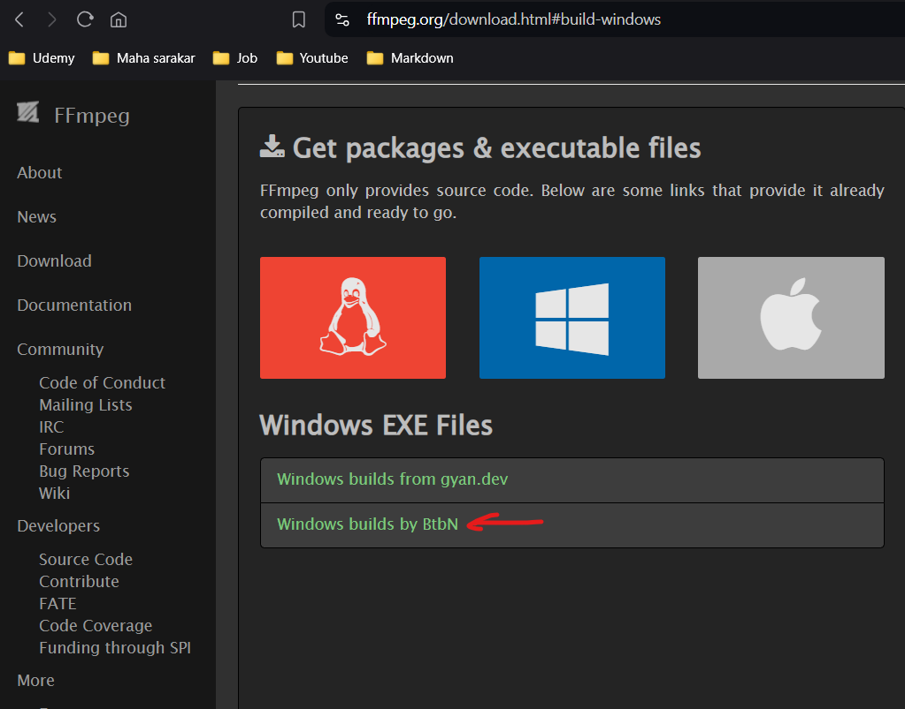

# FFMPEG

## Install FFMPEG on Windows

1. [DownLoad Link](https://www.ffmpeg.org/download.html)



2. Download [windows](https://github.com/BtbN/FFmpeg-Builds/releases/download/latest/ffmpeg-master-latest-win64-gpl.zip) from [Release](https://github.com/BtbN/FFmpeg-Builds/releases)

3. Place it in c://ffmpeg/<all_exe_file>
4. Add Above path in envoirnment variable eg. C:\ffmpeg
5. Run `ffmpeg` command in terminal to check proper installation

## Laravel

1. Install package

```bash
composer require pbmedia/laravel-ffmpeg
```

2. Create ffmpeg file in config`(config\ffmpeg.php)` or get following variable from env

```php
<?php

return [
    'ffmpeg_binaries' => 'C:/ffmpeg/ffmpeg.exe', // Replace with your FFmpeg path
    'ffprobe_binaries' => 'C:/ffmpeg/ffprobe.exe', // Replace with your FFmpeg path
];
```

3. In `app\Http\Controllers\VideoController.php`

```php
use FFMpeg\FFMpeg; // and other use like Storage etc.
```

- `snapshot function`

```php
public function generateThumbnail(Request $request)
{
    $filePath = storage_path("app/public/Welcome to Node JS.mp4"); // your video file path
    $thumbnailFileName = "abc.jpg"; // thumbnail name
    $thumbnailDirectory = "users/private/video/thumbnails"; // thumbnail path
    $thumbnailPath = "{$thumbnailDirectory}/{$thumbnailFileName}";

    if (!Storage::exists($thumbnailDirectory)) {
        Storage::makeDirectory($thumbnailDirectory, 0755, true);
    }
    try {
        $ffmpeg = \FFMpeg\FFMpeg::create(
            [
                'ffmpeg.binaries' => config('ffmpeg.ffmpeg_binaries'),
                'ffprobe.binaries' => config('ffmpeg.ffprobe_binaries'),
            ]
        );
        $video = $ffmpeg->open($filePath);
        $frame = $video->frame(\FFMpeg\Coordinate\TimeCode::fromSeconds(25));
        $frame->save(storage_path("app/{$thumbnailPath}"));
        return $thumbnailPath;
    } catch (Exception $e) {
        Log::error('Error while generating thumbnail for file: ' . $e->getMessage());
        return response()->json([
            'type' => 'error',
            'code' => 500,
            'status' => false,
            'message' => 'Error while processing.',
            'toast' => true
        ]);
    }
}
```

- `m3u8 function`

```bash
public function convertToHLS(Request $request)
{
    $folderPath = "users/private/m3u8";

    $outputFilePath = storage_path("app/public/welcome_node_js.mp4");
    $ffmpegPath = config('ffmpeg.ffmpeg_binaries');

    if (!Storage::exists($folderPath)) {
        Storage::makeDirectory($folderPath);
    }


    // Generate 480p version
    $playlistPath480p = storage_path("app/{$folderPath}/playlist_480p.m3u8");
    $command480p = "{$ffmpegPath} -i " . escapeshellarg($outputFilePath) . " -vf scale=w=854:h=480 -c:a copy -start_number 0 -hls_time 10 -hls_list_size 0 -f hls " . escapeshellarg($playlistPath480p);
    exec($command480p);

    $returnedPath = "{$folderPath}/playlist_480p.m3u8";

    return $returnedPath;
}
```
